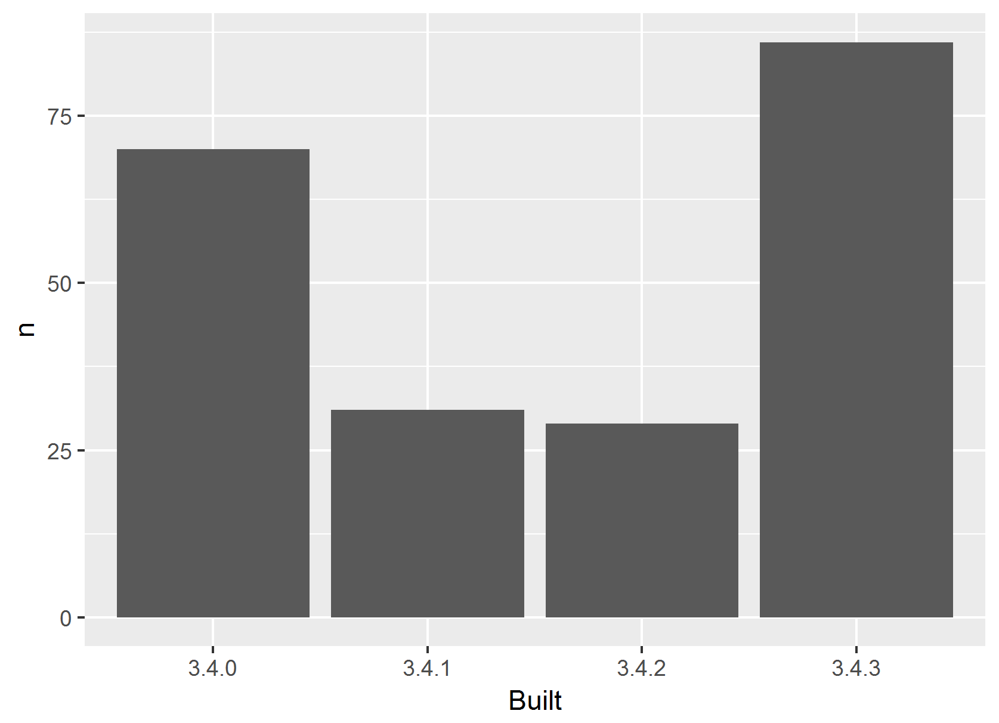

<!-- README.md is generated from README.Rmd. Please edit that file -->
``` r
library(tidyverse)
```

    ## Warning: package 'tidyverse' was built under R version 3.4.3

    ## -- Attaching packages ---------------------------- tidyverse 1.2.1 --

    ## v ggplot2 2.2.1.9000     v purrr   0.2.4     
    ## v tibble  1.4.1          v dplyr   0.7.4     
    ## v tidyr   0.7.2          v stringr 1.2.0     
    ## v readr   1.1.1          v forcats 0.2.0

    ## Warning: package 'tibble' was built under R version 3.4.3

    ## Warning: package 'tidyr' was built under R version 3.4.3

    ## Warning: package 'purrr' was built under R version 3.4.3

    ## Warning: package 'dplyr' was built under R version 3.4.3

    ## -- Conflicts ------------------------------- tidyverse_conflicts() --
    ## x dplyr::filter() masks stats::filter()
    ## x dplyr::lag()    masks stats::lag()

``` r
library(here)
```

    ## Warning: package 'here' was built under R version 3.4.3

    ## here() starts at C:/Users/jrl/Desktop/packages-report

packages-report
===============

Workshop challenge checklist
----------------------------

*As you complete tasks, you can ~~cross them out~~ by surrounding with `~~`.*

-   Have a look around the files here. Where are the R scripts? What are the directories `data` and `figs` for?
-   Notice that this README is an `.Rmd` file. That means it could contain R code and will need to be rendered to create `README.md`.
-   Open [R/01\_write-installed-packages.R](R/01_write-installed-packages.R). Write the script as directed. Run it. Commit and push the current state.
-   Open [R/02\_wrangle-packages.R](R/02_wrangle-packages.R). Fill in the missing pieces of the script as directed. Run it. Commit and push the current state.
-   Open [R/03\_barchart-packages-built.R](R/03_barchart-packages-built.R). Fill in the missing pieces of the script as directed. Run it. Commit and push the current state.
-   Fill in the blanks below in this README, using the results stored elsewhere.
-   If you get this far, write an R script to run the whole analysis and, perhaps, another script that does a `make clean` style reset.

Overview
--------

The goal of packages-report is to identify the frequency of built packages.

``` r
sum(apt_freqtable$n) 
#> [1] 216
```

I have `216` add-on packages installed.

Here's how they break down in terms of which version of R they were built under, which is related to how recently they were updated on CRAN.

    #> # A tibble: 4 x 3
    #>   Built     n  prop
    #>   <chr> <int> <dbl>
    #> 1 3.4.0    70 0.324
    #> 2 3.4.1    31 0.144
    #> 3 3.4.2    29 0.134
    #> 4 3.4.3    86 0.398



### Flow of the analysis

*If you have time, document the analysis works, using internal links.*
